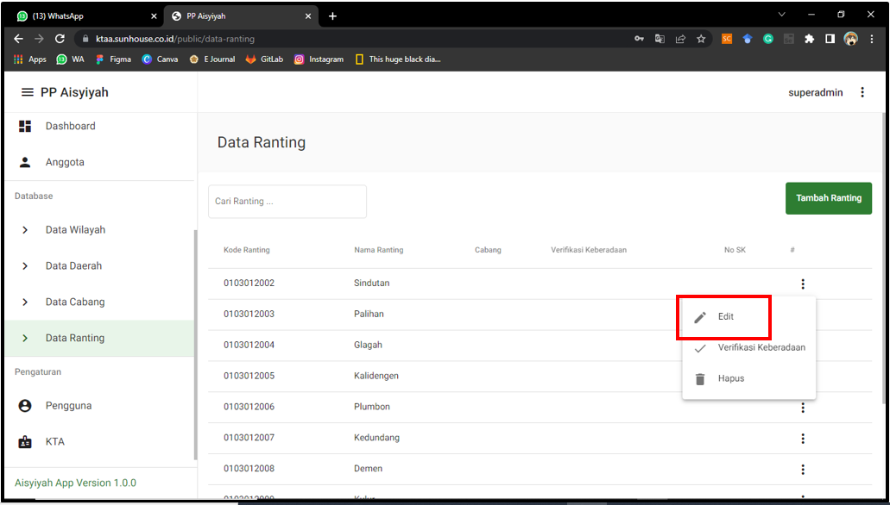
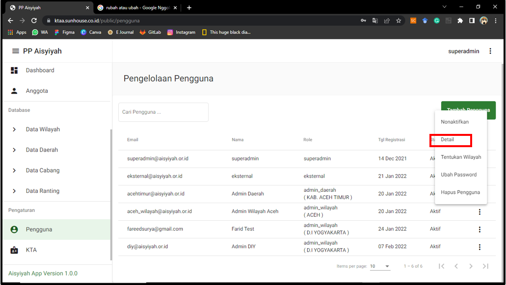

# Petunjuk Penggunaan KTAA

## Daftar Isi

[TOC]

## Otentikasi Pengguna

### Login

Buka halaman melalui https://ktaa.sunhouse.co.id/. Masukkan username dan password kemudian Klik “Masuk”.

### Keluar

Klik Icon “ ” pada pojok kanan atas halaman > Klik “Keluar” > Klik “OK” pada kotak dialog

## Dashboard

- Menampilkan data statistik Pimpinan Aisyiyah: Pimpinan wilayah, pimpinan daerah, pimpinan cabang, pimpinan ranting, dan pimpinan cabang istimewa.
- Menampilkan jumlah Anggota Aisyiyah
- Menampilkan data jumlah Anggota Aisyiyah berdasarkan wilayah

## Pengelolaan Data Anggota

### Bagaimana Cara Menambah Anggota

Anggota > Tambah Anggota> Isi Form > Klik “Simpan”

### Bagaimana Cara Melakukan Pencarian Anggota yang  Telah Terdaftar
Anggota > Pencarian Anggota > Masukkan nama atau nomor anggota pada kotak perncarian > Tekan Enter

### Bagaimana Cara Melihat Daftar Anggota
Anggota > Daftar Anggota 
Anda dapat mengatur/ menyortir data yang muncul pada halaman dengan cara klik icon “” kemudian pilih berdasarkan : Data Terakhir, Wilayah, Daerah, Cabang ataupun Ranting.

### Bagaimana Cara Mengubah Data Anggota
Anggota > Daftar Anggota > Detail > Lalu isikan data yang ingin diubah setelah itu klik “Perbarui Data”

### Bagaimana Cara Mengubah Foto pada Kartu Anggota
Anggota > Daftar Anggota > Detail > Klik Area Foto untuk mengubah foto pada Kartu Tanda Anggota> Setelah itu Klik “Perbarui Data”

### Bagaimana Cara Mencetak Kartu Anggota
Anggota > Daftar Anggota > Detail > Centang pada “Tampilkan alamat lengkap” jika ingin alamat lengkap> Klik “Cetak Kartu”

## Pengelolaan Pembayaran

### Bagaimana Cara Melihat Daftar Pembayaran
Klik pada menu “Pembayaran” di sisi kiri halaman, maka akan muncul tampilan sebagai berikut.

### Bagaimana Cara Menambahkan Konfirmasi Pembayaran
Menu “Pembayaran” > Klik Fitur “Tambah Konfirmasi Pembayaran”> akan muncul form seperti pada gambar berikut (isikan data pada form tersebut) > Klik “Simpan”

### Bagaimana Cara Menghapus Data Konfirmasi Bayar
Menu “Pembayaran” > Klik “Detail” > Akan muncul tampilan seperti gambar berikut > Klik “Hapus” > Akan muncul kotak dialog > Klik “OK” untuk melanjutkan menghapus  data konfirmasi pembayaran

## Pengelolaan Database Wilayah

### Bagaimana Cara Mencari Data Wilayah

Data Wilayah> Isikan nama wilayah/kode wilayah/No Sk 

### Bagaimana Cara Menambah Wilayah
Data Wilayah> Klik Tombol “Tambah Wilayah” > Isikan Data yang Diminta > Klik “Simpan”

### Bagaimana Cara Mengubah Data Wilayah
Data Wilayah> Klik Icon “” > Klik “Edit” > Ubah data yang diinginkan > Klik “Simpan”

### Bagaimana Cara Memverifikasi dan Membatalkan Verifikasi Wilayah
Data Wilayah> Klik Icon “” > Klik “Edit” > Klik “Batalkan Verifikasi” untuk membatalkan Verifikasi / Klik “Verifikasi Keberadaan” untuk memberikan verifikasi.

### Bagaimana Cara Menghapus Wilayah
Data Wilayah> Klik Icon “” > Klik “Hapus”> Masukkan kode > Klik “Hapus”

## Pengelolaan Database Daerah

### Bagaimana Cara Mencari Data Daerah

Data Daerah> Isikan nama daerah/kode daerah/No Sk 

### Bagaimana Cara Menambah Daerah
Data Daerah> Klik Tombol “Tambah Daerah” > Isikan Data yang Diminta > Klik “Simpan”

### Bagaimana Cara Mengubah Data Daerah
Data Daerah> Klik Icon “” > Klik “Edit” > Ubah data yang diinginkan > Klik “Simpan”

### Bagaimana Cara Memverifikasi dan Membatalkan Verifikasi Daerah
Data Daerah> Klik Icon “” > Klik “Edit” > Klik “Batalkan Verifikasi” untuk membatalkan Verifikasi / Klik “Verifikasi Keberadaan” untuk memberikan verifikasi.

### Bagaimana Cara Menghapus Daerah
Data Daerah> Klik Icon “” > Klik “Hapus” > Masukkan kode > Klik “Hapus”

## Pengelolaan Database Cabang

### Bagaimana Cara Mencari Data Cabang

Data Cabang> Isikan nama daerah/kode daerah/No Sk 

### Bagaimana Cara Menambah Cabang
Data Cabang> Klik Tombol “Tambah Cabang” > Isikan Data yang Diminta > Klik “Simpan”

### Bagaimana Cara Mengubah Data Cabang
Data Cabang> Klik Icon “” > Klik “Edit” > Ubah data yang diinginkan > Klik “Simpan”

### Bagaimana Cara Memverifikasi dan Membatalkan Verifikasi Cabang
Data Cabang> Klik Icon “” > Klik “Edit” > Klik “Batalkan Verifikasi” untuk membatalkan Verifikasi / Klik “Verifikasi Keberadaan” untuk memberikan verifikasi.

### Bagaimana Cara Menghapus Cabang
Data Cabang> Klik Icon “” > Klik “Hapus” > Masukkan kode > Klik “Hapus” 

## Pengelolaan Database Ranting

### Bagaimana Cara Mencari Data Ranting

Data Ranting> Isikan nama daerah/kode daerah/No Sk 

### Bagaimana Cara Menambah Ranting
Data Ranting> Klik Tombol “Tambah Ranting” > Isikan Data yang Diminta > Klik “Simpan”

### Bagaimana Cara Mengubah Data Ranting
Data Ranting> Klik Icon “” > Klik “Edit” > Ubah data yang diinginkan > Klik “Simpan”

### Bagaimana Cara Memverifikasi dan Membatalkan Verifikasi Ranting
Data Ranting> Klik Icon “” > Klik “Edit” > Klik “Batalkan Verifikasi” untuk membatalkan Verifikasi / Klik “Verifikasi Keberadaan” untuk memberikan verifikasi.

### Bagaimana Cara Menghapus Ranting
Data Ranting> Klik Icon “” > Klik “Hapus”> Masukkan kode > Klik “Hapus”

## Pengelolaan Data Pengguna

### Bagaimana Cara Mencari Pengguna

Pengguna > isikan email/nama/role pada kotak pencarian

### Bagaimana Cara Menambahkan Pengguna
Pengguna> Klik Tombol “Tambah Pengguna” > Isikan Data yang Diminta > Klik “Simpan”

### Bagaimana Cara Mengubah Data Pengguna
Pengguna> Klik Icon “” > Klik “Detail” > Ubah data yang diinginkan > Klik “Simpan”

### Bagaimana Cara Mengubah Password
Pengguna> Klik Icon “” > Klik “Ubah Password” > Tuliskan password baru > Klik “Simpan”

### Bagaimana Cara Menonaktifkan/Mengaktifkan Pengguna
Pengguna> Klik Icon “” > Klik “Nonaktifkan” atau klil “Aktifkan”

### Bagaimana Cara Menghapus Pengguna
Pengguna> Klik Icon “” > Klik “Hapus Pengguna”> Masukkan kode> Klik “Hapus”

## Pengelolaan Tampilan Kartu Anggota

### Bagaimana Cara Mengubah Nama Ketua Umum dan Sekretaris Umum pada Kartu Anggota

KTA> Ubah nama pada kotak nama Ketua Umum dan Sekretaris Umum > Klik “Simpan Perubahan”

### Bagaimana Cara Mengubah Tanda Tangan pada Kartu Anggota
KTA> Tanda Tangan> Klik “Ganti ttd”> Pilih File > Klik “Gunakan Foto” > Klik “Simpan Perubahan”

### Bagaimana Cara Mengubah Cap pada Kartu Anggota
KTA> Stempel> Klik “Ganti Stempel”> Pilih File > Klik “Gunakan Foto”> Klik “Simpan Perubahan”

